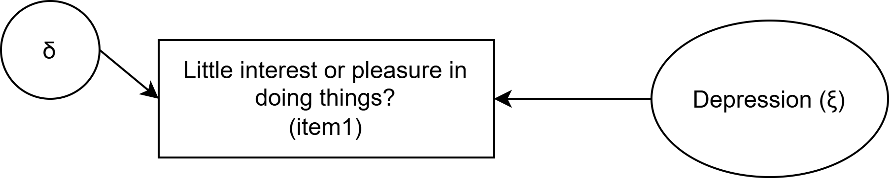
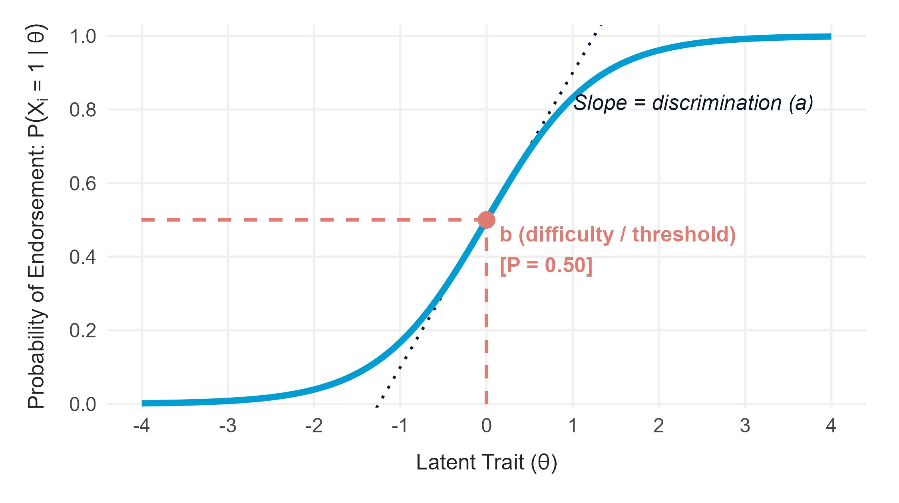
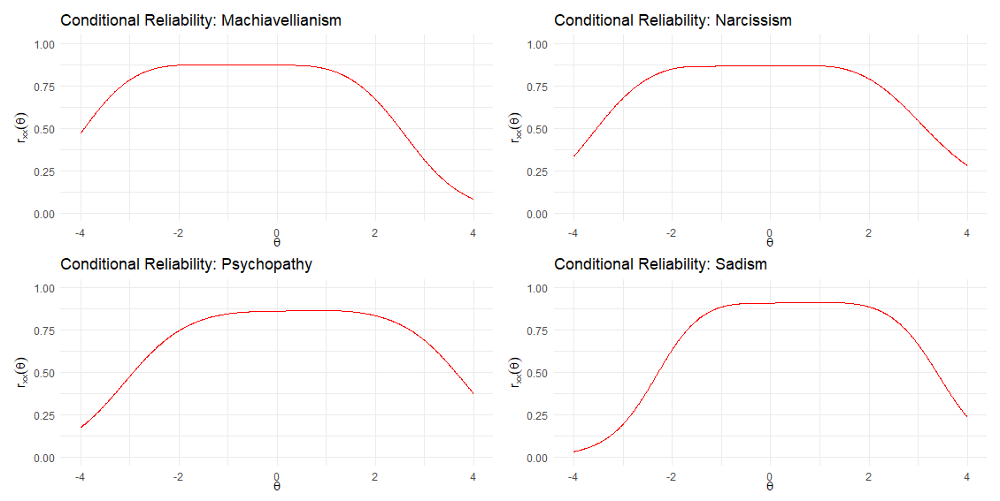
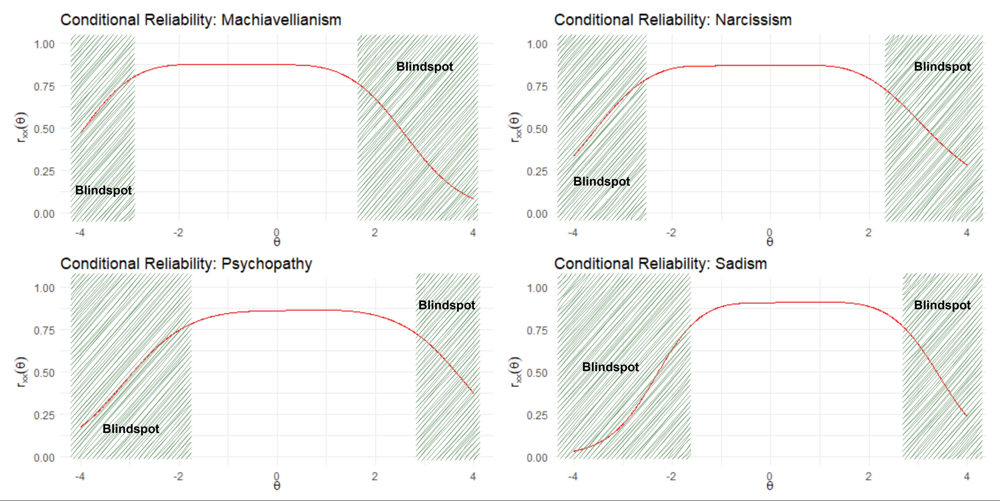
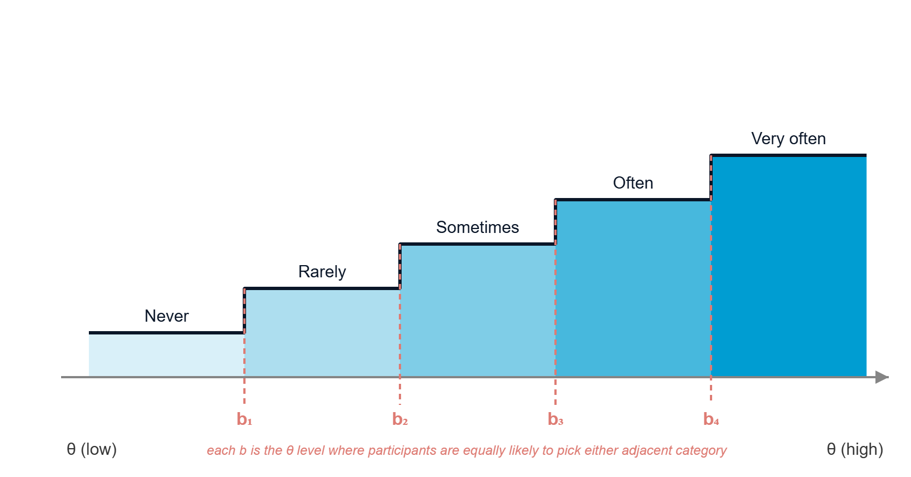
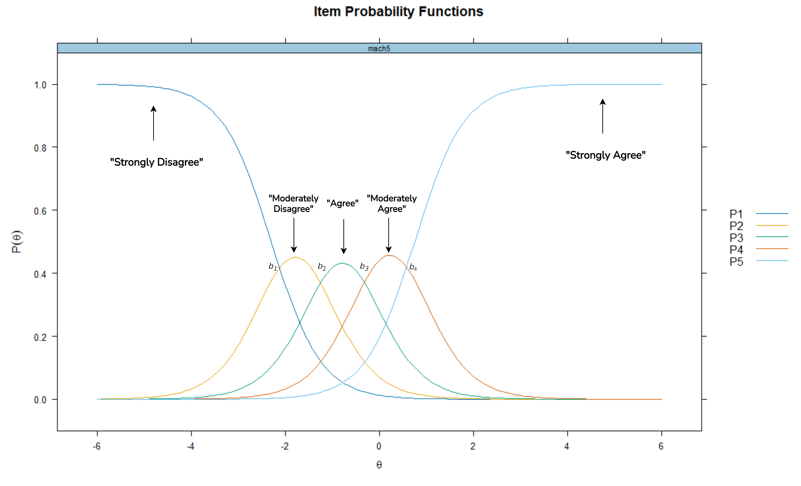
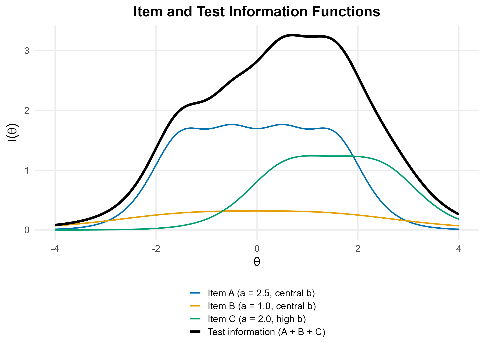

## AGENDA {.agenda-slide}
<!-- Klasse: .agenda-slide -->

1. What makes IRT different from "default" factor analysis (classical test theory - CTT)?
2. Meet the IRT family
3. Item and model parameters of the Graded Response Model (GRM)
4. Hands-On: Fitting a GRM 
5. Using the results
6. Wrap-up, discussion, and Q&A

## {.section-slide}
<!-- Zwischentitelfolie 01 -->

::: {.section-number}
01
:::

::: {.section-bubble}
What makes IRT different from CTT? 
:::

## Three points of divergence {.columns-slide}

::: {.lead}
Although CTT and IRT share similar fundamental assumptions, they differ in at least three aspects below.
:::

::: {.columns-area}
::: {.col-item .text-center}
[<i class="fa-solid fa-chart-line"></i>]{.col-icon}

### Item-Latent Variable Relationship: Linear vs. Probabilistic
 
**IRT models the relationship between items and the latent variable using probabilistic function.**  
 
CTT primarily expresses this relationship as a linear term.
:::
::: {.col-item .text-center}
[<i class="fa-solid fa-gauge-high"></i>]{.col-icon}

### Reliability: A "one-for-all" coefficient vs. A spectrum
 
**IRT allows reliability to vary along with the latent trait spectrum.**  
 
CTT strongly assumes that reliability (thus measurement error) remains similar for the whole sample.
:::
::: {.col-item .text-center}
[<i class="fa-solid fa-scale-balanced"></i>]{.col-icon}

### Invariance: Scale- vs. Item-level
 
**IRT enables estimation of invariance at both item- (i.e., "differential item functioning" or DIF) and scale-level (i.e., "differential test functioning" or DTF).**  
 
CFA tests invariance via item loadings and intercepts, usually judged by changes in overall model fit. 
:::
:::

## 1️⃣ Linear vs. Probabilistic {.text-slide-bg}

::: {.lead}
This equation illustrates what factor analysis looks like. The relationship between the latent trait `depression` and the item used to measure it is linear.
:::

{fig-align="center" width="50%"}

$$Item_i = \tau + \lambda \cdot \xi + \delta$$

::: {.incremental .text-small}
* $\tau$ (tau) — the item **intercept**: the expected item score when the latent trait is 0.
* $\lambda$ (lambda) — the **factor loading**: how much the item is expected to change per one-unit change in the latent trait. This is our regression *slope*.
* $\xi$ (xi) — the **latent variable** itself, here playing the role of the predictor.
* $\delta$ (delta) — the **residual/unique factor**: the part of the item's variance not explained by the latent trait (measurement error + item-specific variance).
:::

. . .

::: {.callout-warning}
### BUT CFA can be nonlinear too
Standard CFA assumes continuous items and a strictly linear relationship. When items are **ordinal** or **categorical**, CFA can incorporate thresholds and non-linear link functions (e.g., categorical CFA via `WLSMV`, [see details here](https://lavaan.ugent.be/tutorial/est.html)) which is closely related to polytomous IRT.
:::

## 1️⃣ Linear vs. Probabilistic {.text-slide-bg}

::: {.lead}
In contrast, IRT models this relationship as a **probabilistic function**, so the relationship between the latent trait and the observed score is non-linear. Suppose that we have an item with [**two response categories**]{style="color: red;"} (yes/no), the probability curve would look like this:
:::

::: columns
::: {.column width="55%"}
{fig-align="center"}
:::

::: {.column width="45%"}
$$P(X_i = 1 \mid \theta) = \frac{1}{1 + e^{-a_i(\theta - b_i)}}$$

. . .

::: {.incremental}
* $\theta$ (theta) — the **latent trait** of the participant (predictor, *analogous to* $\xi$ in CFA).
* $b_i$ — the item **difficulty/threshold**: the trait level where the probability of endorsement is 50% ($P = 0.50$).
* $a_i$ — the item **discrimination**: the slope at the inflection point, showing how sharply the item differentiates (*similar but not identical to* loading $\lambda$ in CFA).
:::
:::
:::

## 2️⃣ Single Reliability Coefficient vs. A Spectrum {.text-slide-bg}

::: {.lead}
CTT gives **one** reliability coefficient for the whole sample.
:::

::: {.content-box}
::: {.incremental}
- It assumes measurement error is the same for everyone, regardless of their trait level.
- A scale measuring people's everyday discrimination experiences might sharply distinguish people with *very high* exposure of discrimination, but may be less optimal to capture people in the moderate range.
  + In some contexts, this is exactly where policy-relevant nuance often lives.
- CTT can't show *where* exactly on the latent trait spectrum our instrument is less or more optimal, but **item response theory (IRT) can**.
:::
:::

## 2️⃣ Single Reliability Coefficient vs. A Spectrum {.text-slide-bg}

::: {.lead}
These **conditional reliability** curves illustrate how measurement precision varies across different levels of the latent trait ($\theta$).
:::

{fig-align="center" width="80%"}

## 2️⃣ Single Reliability Coefficient vs. A Spectrum {.text-slide-bg}

::: {.lead}
Notice that along certain parts of the spectrum, very little information is available, leading to higher measurement error and lower reliability. These regions are exactly the **blindspots** that the scale cannot optimally capture.
:::

{fig-align="center" width="70%"}

## 3️⃣ Scale- vs. Item-level Invariance {.text-slide-bg}

::: {.lead}
As we saw earlier in multigroup CFA, measurement invariance tests whether an instrument behaves equivalently across groups.
:::

::: {.content-box}
::: {.incremental}
- **CFA/CTT:** Tests invariance step by step (configural → metric → scalar), mainly via changes in overall model fit; locating/identifying problematic items can be done by applying partial invariance.
- **IRT (DIF & DTF):** Directly pinpoints **Differential Item Functioning (DIF)** at the individual item level along the trait continuum $\theta$:
  - *Uniform DIF:* An item is systematically easier/harder to endorse for one group across all trait levels (difference in threshold parameter - $b$).
  - *Non-uniform DIF:* An item discriminates differently across groups (difference in discrimination parameter - $a$).
- **Differential Test Functioning (DTF):** Aggregates item-level DIF to assess whether **item biases cancel out or compound** across the overall scale score.
:::
:::

## {.section-slide}
<!-- Zwischentitelfolie 02 -->

::: {.section-number}
02
:::

::: {.section-bubble}
Meet the IRT Family
:::

## Item Parameters: *a* and *b* {.text-slide-bg}

::: {.lead}
In a typical IRT model, each item get at least **one threshold parameter (*b*)**. Some models allow an item to have **one discrimination parameter (*a*)** plus **one or several** thresholds (*b*).
:::

::: {.content-box}
::: {.incremental}
* **$b$ (threshold or difficulty):** *where* on the $\theta$ continuum the response category is doing its work. 
  - A more "technical" definition: $b$ is the point on the $\theta$ continuum where the probability of responding in this category or higher reaches 50%.
  - The number of $b$ we get depends on how many response categories are in our scale (`n response categories - 1`).
* **$a$ (discrimination):** denotes *how strongly* the item differentiates between participants with lower or higher levels of $\theta$. 
  - A larger $a$ value means a steeper probability curve, indicating that the specific item yields more information.
* Rule of thumbs ([Baker & Kim, 2017](https://link.springer.com/book/10.1007/978-3-319-54205-8)): 
  + $a$ less than 0.35 = very low; + 0.35 – 0.64 = low; + 0.65 – 1.34 = moderate; + 1.35 – 1.69 = high; 1.70 or more = very high
:::
:::

## The IRT Family {.text-slide-bg}

::: {.lead}
1PL, 2PL and 3PL models are built for **binary** data (correct/incorrect, yes/no). We are primarily interested in **Likert-type** (i.e., polytomous), and that's what GRM is for.
:::

::: {.content-box}
| Model | Data type | What it estimates |
|---|---|---|
| 1PL/Rasch | Dichotomous | item difficulty only (equal discrimination assumed) |
| 2PL | Dichotomous | item difficulty **and** discrimination |
| 3PL | Dichotomous | item difficulty and discrimination + pseudo-guessing params |
| **GRM** | **Polytomous (ordered categories)** | **discrimination *a* + multiple thresholds *b* per item** |

:::

::: {.callout-important appearance="simple"}
The 3PL adds a third item parameter, *c* ([pseudo-guessing](https://assess.com/irt-item-pseudo-guessing-parameter/)), to capture the chance of endorsement at very low trait levels.  
In addition to the examples shown above, there are many other IRT variants that are specifically calibrated to estimate models with *n* dimensions, *n* response categories, various response formats and response styles.
:::

## {.section-slide}
<!-- Zwischentitelfolie 03 -->

::: {.section-number}
03
:::

::: {.section-bubble}
Item, Model Parameters, and Assumptions of the Graded Response Model (GRM)
:::

## The Staircase Illustration {.text-slide-bg}

{fig-align="center" width="70%"}

::: {.incremental}
* For an item with 5 response categories, GRM estimates **4 thresholds** ($b_1$–$b_4$).

* Each threshold marks the point on $\theta$ where a participant becomes more likely to score at-or-above that category boundary than below it (formally, cumulative probability = 0.5), as in a staircase they "step up" as their trait level rises.

* The mean of $\theta$ is usually centered around 0, so a threshold like $b_1 = -1.2$ means: people about 1.2 *SD* below the mean are the ones flipping between the two lowest categories.
:::

## Item Probability Curves {.text-slide-bg}

::: {.lead}
Suppose that we have a Likert-type item with five response categories. The, we plot the probability of endorsing each category against $\theta$, where each threshold represents the transition boundary between two adjacent categories.
:::

::: columns
::: {.column width="60%"}

:::
::: {.column width="40%"}
::: {.incremental}
- The two **extreme** categories ("Never"/"Very often") are bounded by only *one* threshold instead of two, so their curves rise or fall monotonically rather than peak as in the others.
- The **middle** categories peak in a bell shape between two thresholds.
- Steep, well-separated curves = an item that sharply distinguishes people near that threshold.
- Flat, overlapping curves = an item that isn't telling us much at that part of the scale.
:::
:::
:::

## Item and Test Information {.text-slide-bg}

::: {.lead}
**Information** tells us *how precisely* we can locate a participant on $\theta$: the more information, the smaller the measurement error at that trait level.
:::

::: columns
::: {.column width="55%"}
{fig-align="center"}
:::
::: {.column width="45%" .text-small}
::: {.incremental}
- **Item information** $I_i(\theta)$: each item is precise only in part of the $\theta$ range.
  - *Height* depends on $a$: steeper items (A, C) carry more information than flat ones (B).
  - *Location* depends on $b$: an item is informative around its thresholds (C only works at high $\theta$).
- **Test information** $I(\theta) = \sum_i I_i(\theta)$: item information simply **adds up**, so adding items targeted at a weak region closes that gap.
- This is what the conditional reliability curves and **blindspots** from earlier are built on.
:::
:::
:::

## Model Fit Parameters {.text-slide-bg}

::: {.lead}
Beyond item parameters (*a*, *b*), we also need to know whether the GRM **as a whole** actually fits the data. `mirt` gives us this via `M2()` (overall model fit) and `itemfit()` (item-level fit).
:::

::: {.content-box .text-small}
| Model Fit Params | Good Fit When | Additional Infos |
|---|---|---|
| $M_2$ or $C_2$ *p*-value | *n.s.* | sensitive to large *N*; almost always significant in big samples, $C_2$ used in polytomous data |
| [RMSEA](https://psycnet.apa.org/record/2014-30220-001) | ≤ .05 | .05–.08 = acceptable; unreliable with few items/df |
| [SRMSR](https://psycnet.apa.org/record/2014-30220-001) | ≤ .05 | .05–.08 = acceptable |
| [CFI](https://www.tandfonline.com/doi/abs/10.1080/10705519909540118) | ≥ .95 | .90–.95 = acceptable |
| [TLI](https://www.tandfonline.com/doi/abs/10.1080/10705519909540118) | ≥ .95 | .90–.95 = acceptable |
: {tbl-colwidths="[30,18,52]"}
:::

::: {.incremental}
* Avoid relying on a single index.
* At the **item level**, `itemfit()` gives us $S\text{-}X^2$ and its corresponding *p*-value.
  - Large *p*-values are *desirable*, and we will see why in the hands-on session.
:::

## Three Assumptions {.columns-slide}

::: {.lead}
Before trusting GRM model and item parameters, three core construct assumptions need to hold, which closely mirroring those in factor analysis:
:::

::: {.columns-area}
::: {.col-item .text-center}
[]{.col-icon .fa-solid .fa-arrow-trend-up}

### Monotonicity

Higher $\theta$ → higher probability of endorsing a stronger response category.
:::

::: {.col-item .text-center}
[]{.col-icon .fa-solid .fa-layer-group}

### Unidimensionality

One $\theta$ underlies the item pool, we already checked this in the factor analysis session.
:::

::: {.col-item .text-center}
[]{.col-icon .fa-solid .fa-link-slash}

### Local Independence

Once $\theta$ is accounted for, items shouldn't still correlate with each other. In practice, expect *some* residual dependence, but the question is whether its severity is still within our tolerance.
:::
:::

::: {.callout-tip appearance="simple"}
These assumptions aren't absolute. There are some advanced IRT models that don't explicitly make one or more of the above assumptions.
:::

## {.section-slide}
<!-- Zwischentitelfolie 04 -->

::: {.section-number}
04
:::

::: {.section-bubble}
Hands-On: Fitting a GRM
:::

## Today's Exercise {.text-slide-bg}

::: {.lead}
We'll fit a GRM together on a 7-item scale from the NaDiRA survey measuring discrimination experience.
:::

::: {.content-box}
* **Items:** 7 Everyday Discrimination scale items (`ker_diskerf_*`, adapted from [Williams, et al., 1997](https://journals.sagepub.com/doi/10.1177/135910539700200305)), 6-point frequency scale (*Täglich*/Daily → *Nie*/Never).
* **Data:** Teaching extract of the NaDiRA dataset (*N* = 1,000; 972 complete cases), with a calibrated simulated option as fallback.
* **Document (two options):** `exercise.qmd` or `exercise.Rmd` — open it now in RStudio and follow along.
* You can compare the results with a published paper investigating the psychometric properties of the same (but longer) scale in Austrian sample: Amini-Nejad, R., Hirsch, S., Goreis, A., Nater, U. M., & Nater-Mewes, R. (2025). Factor Structure and Validity of a German Version of the Everyday Discrimination Scale Among Immigrants From Türkiye. *Psychological Test Adaptation and Development*, 6, 216–237. <https://doi.org/10.1027/2698-1866/a000110>
:::

## Open `exercise.qmd` {.text-slide-bg}

::: {.lead .text-center}
Let's switch to RStudio.

[Click on this link to be redirected to the rendered `html`](../files/exercise.html)
:::

::: {.content-box .text-center}
We'll walk through Steps 0–9 together: setup → meet the dataset → quick data check → dimensionality → fit GRM → item probability curves → item &amp; test information → reliability → model and item fit → residual correlations ($Q_3$).
:::

## {.section-slide}
<!-- Zwischentitelfolie 05 -->

::: {.section-number}
05
:::

::: {.section-bubble}
Using the Results
:::

## When (Not) to Use GRM {.columns-slide}

::: {.columns-area}
::: {.col-item .text-center}
[]{.col-icon .fa-solid .fa-users}

### Sample size

Stable item parameters generally need a few hundred participants or more, so it is not a reasonable modeling choice for a 30-person pilot.
:::

::: {.col-item .text-center}
[]{.col-icon .fa-solid .fa-shapes}

### Unidimensionality

If our EFA/CFA suggests multiple factors, a unidimensional GRM is the wrong choice. In this case, consider multidimensional GRM instead.
:::

::: {.col-item .text-center}
[]{.col-icon .fa-solid .fa-comments}

### Not a replacement

GRM tells us about *statistical* precision. It doesn't and cannot replace the focus groups, coding, and content validity work that we already learned on Day 1.
:::
:::

## {.section-slide}
<!-- Zwischentitelfolie 06 -->

::: {.section-number}
06
:::

::: {.section-bubble}
Wrap-Up &amp; Discussion
:::

## Resources &amp; Contact {.text-slide-bg}

::: {.content-box}
* **Textbooks (beginner → advanced):**
  + *Beginner:* Embretson, S. E., &amp; Reise, S. P. (2026). [*Item Response Theory: Foundations for Psychologists and Social Scientists (2nd edition).*](https://www.routledge.com/Item-Response-Theory-Foundations-for-Psychologists-and-Social-Scientists/Embretson-Reise/p/book/9781315726557) Routledge.
  + *Intermediate:* de Ayala, R. J. (2022). [*The Theory and Practice of Item Response Theory (2nd edition).*](https://www.guilford.com/books/The-Theory-and-Practice-of-Item-Response-Theory/R-de-Ayala/9781462547753?srsltid=AU7gw4WRbvBzG1CVjESm5q_67LK6uihlEO6yR6KBU1ArUnmAqVXGxngk) Guilford Press.
  + *Intermediate/Advanced:* DeMars, C. (2010). [*Item Response Theory.*](https://global.oup.com/academic/product/item-response-theory-9780195377033?cc=si&lang=en&) Oxford University Press.
  + *Advanced:* van der Linden, W. J. (Ed.). (2016). [*Handbook of Item Response Theory*](https://www.taylorfrancis.com/books/edit/10.1201/9781315374512/handbook-item-response-theory-wim-van-der-linden) (Vols. 1–3). CRC Press.
* **Tutorial paper:** Zein, R. A., &amp; Akhtar, H. (2025). *Getting started with the graded response model: An introduction and tutorial in R.* International Journal of Psychology, 60(1), e13265. <https://doi.org/10.1002/ijop.13265>
* **Questions afterwards:** [amelia.zein@cais-research.de](mailto:amelia.zein@cais-research.de) or [amelia.zein@psikologi.unair.ac.id](mailto:amelia.zein@psikologi.unair.ac.id).
:::

## {.closing-slide .no-footer}

::: {.closing-left}
::: {.closing-contact-box}
**Dr. Rizqy Amelia Zein**\
Center for Advanced Internet Studies (CAIS) & Universitas Airlangga\
E-mail: [amelia.zein@cais-research.de](mailto:amelia.zein@cais-research.de) · Homepage: [rameliaz.github.io](https://rameliaz.github.io/)
:::

::: {.closing-cais-logo}

:::
:::

::: {.closing-right}
::: {.closing-text}
Thank you!
:::

::: {.closing-bottom}
::: {.closing-org}
Center for Advanced Internet Studies (CAIS) gGmbH

Konrad-Zuse-Str. 2a, 44801 Bochum
:::

::: {.closing-contact-info}
[info@cais-research.de](mailto:info@cais-research.de)\
+49 234 9531 5000\
[www.cais-research.de](https://www.cais-research.de)
:::

::: {.closing-social}
<a href="https://www.linkedin.com/company/center-for-advanced-internet-studies" title="LinkedIn"><i class="fa-brands fa-linkedin-in"></i></a>
<a href="https://bsky.app/profile/cais-research.bsky.social" title="Bluesky"><i class="fa-brands fa-bluesky"></i></a>
<a href="https://www.instagram.com/caisnrw/" title="Instagram"><i class="fa-brands fa-instagram"></i></a>
<a href="https://mastodon.social/@CAISnrw" title="Mastodon"><i class="fa-brands fa-mastodon"></i></a>
<a href="https://www.facebook.com/CenterforAdvancedInternetStudies" title="Facebook"><i class="fa-brands fa-facebook-f"></i></a>
<a href="https://www.youtube.com/channel/UClCqAar9lGav5spwJOJgrUw" title="YouTube"><i class="fa-brands fa-youtube"></i></a>
:::
:::
:::
